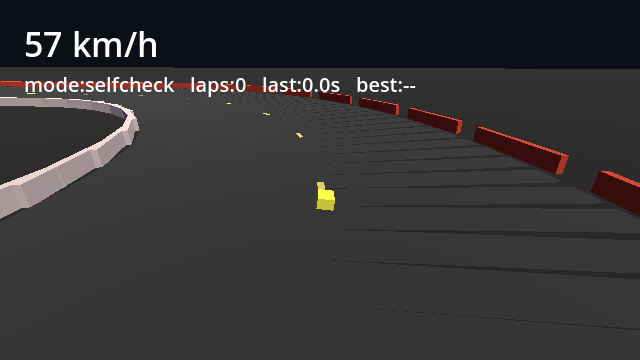
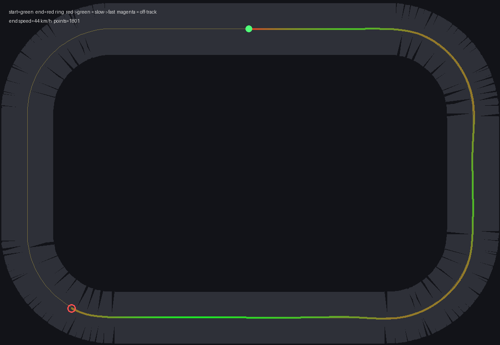

# NEON DELTA — Gray-Box Driving Slice

A tiny, **real-engine** playable slice of the signature NEON DELTA verb:
**driving**. It exists to prove two things at once:

1. The driving verb can feel like something in a gray box (the milestone
   [doc 20](../../docs/20-tech-and-production.md) calls "prove the verbs").
2. An AI can build and **observe its own work** on a game — autonomously
   driving the loop on everything measurable, while a human stays the judge of
   feel. (The method is written up in
   [doc 24](../../docs/24-ai-development-and-self-observation.md).)

It runs on **Godot 4.3**, a genuine game engine, with real `VehicleBody3D`
physics, collisions, and rendering — not a hand-rolled simulation.



## What's here

| File | Role |
|---|---|
| `Main.tscn` / `scripts/main.gd` | Builds the whole world in code: ground, road, barriers, the car, chase cam, HUD, and the run director. |
| `scripts/track.gd` | The rounded-rectangle racing line: off-track detection, lap checkpoints, the centerline the bot chases. |
| `scripts/bot.gd` | The reference "proxy player": pure-pursuit steering + a lookahead corner-speed planner. |
| `tools/fetch_godot.sh` | Downloads the pinned engine into `engine/` (gitignored). |
| `tools/selfcheck.sh` | Runs the autonomous self-observation pass (CI-gradeable: exits non-zero on failure). |
| `tools/plot_run.py` | Renders the top-down diagnostic of a run (needs Pillow). |
| `media/` | A hero frame, a top-down plot, and a sample passing report. |

## Run it

```bash
cd prototype/neon-delta-slice
tools/fetch_godot.sh            # one-time: pull Godot 4.3

# 1) DRIVE IT YOURSELF  (you are the judge of feel)
engine/Godot_v4.3-stable_linux.x86_64 --path .
#   W / ↑ accelerate   S / ↓ brake   A D / ← → steer   R reset

# 2) WATCH THE BOT
GAME_MODE=bot engine/Godot_v4.3-stable_linux.x86_64 --path .

# 3) AUTONOMOUS SELF-CHECK  (drives the bot, asserts, exits 0/1)
tools/selfcheck.sh                 # rendered, captures frames
tools/selfcheck.sh --headless      # logic/telemetry only, faster
python3 tools/plot_run.py "$HOME/.local/share/godot/app_userdata/NEON DELTA — Gray Box Slice"
```

The self-check runs headless-with-rendering via **Xvfb + Mesa software GL**, so
it works on a box with no GPU or display (e.g. CI or a cloud container).

## The verbs sandbox (on foot · shooting · Heat)

Driving is one verb. The **verbs sandbox** (`Sandbox.tscn` / `scripts/sandbox.gd`)
proves the rest of the crime-sandbox loop in the same self-observing way:

- **On foot** — a `CharacterBody3D` you walk/run with gravity + collision.
- **Shooting** — a raycast gun with destructible targets (left-click to fire).
- **Heat** — a 0–5 wanted level that rises when you commit crimes, spawns
  pursuers that chase you, and decays once you stay clean.
- **Enter/exit car** — walk up to the car, **F** to get in and drive a real
  `VehicleBody3D` (WASD), **F** again to get out — the core GTA loop.

```bash
# DRIVE-FREE: walk it yourself  (W A S D move · Shift run · click shoot · R reset)
GAME_MODE=play engine/Godot_v4.3-stable_linux.x86_64 --path . res://Sandbox.tscn

# WATCH THE FOOT-BOT exercise every verb
GAME_MODE=bot  engine/Godot_v4.3-stable_linux.x86_64 --path . res://Sandbox.tscn

# AUTONOMOUS SELF-CHECK (foot-bot walks → shoots → triggers Heat; asserts; 0/1)
tools/selfcheck_foot.sh                 # rendered, captures frames
tools/selfcheck_foot.sh --headless      # logic/telemetry only
```

`selfcheck_foot.sh` asserts **16 invariants**: physics stable, moved far enough,
sane walk speed, reached every waypoint, stayed grounded (no fall-through /
launch), fired the gun, destroyed every target, decent aim, crimes raised Heat,
Heat spawned a pursuer, the pursuer closed in, Heat decays when clean, **got in a
car, drove it >15 m, got back out on foot**, and frames were captured. It writes
`sandbox_selfcheck.json` + `frames_foot/`. The driving slice is untouched and
still has its own `selfcheck.sh`.

## What the loop checks by itself

`selfcheck.sh` drives the bot, logs telemetry, and asserts invariants —
physics stability (no NaN), the car actually moves, reaches a sane speed,
**completes a lap**, stays on track, no absurd cornering g-loads, and that
frames were captured for visual review. It writes:

- `selfcheck.json` — the report + pass/fail.
- `frames/` — chase-cam PNGs (which the AI literally re-opens and looks at).
- `path.csv` + `track.csv` — fed to `plot_run.py` for the top-down view.



## What this slice does NOT decide

Whether the driving is **fun**. The bot can tell you a lap is *completable,
fair, and stable*; it cannot tell you the car feels good to throw into a
corner. That is the one wire left for the human judge — by design. See
[doc 24](../../docs/24-ai-development-and-self-observation.md).

## Bugs the self-observation loop actually caught

This wasn't built right the first time. The loop found, and the fixes
resolved, in order:

1. **A flipped forward vector** — the bot thought it was aligned while the car
   drove the opposite way down the straight. (Caught by the top-down plot.)
2. **A 15× too-weak engine** — `engine_force` set as if it were a scaled value;
   the car crawled. (Caught by the top-speed telemetry.)
3. **An over-optimistic corner-speed model** — the bot believed in grip the car
   didn't have and understeered into the outer wall. (Caught by a chase-cam
   frame showing the car nose-first into a barrier.)
4. **Unstable physics under time-scaling** — fast-iteration `TIME_SCALE`
   destabilised the vehicle and spiked a 238 g reading. (Caught by the
   cornering-load invariant.)

None of these needed a human to spot. The verdict on whether the *result* is
good still does.

## Tuning knobs

Car feel lives at the top of `scripts/main.gd` (`ENGINE_POWER`, `BRAKE_POWER`,
`MAX_STEER`, `WHEEL_FRICTION`, …). The bot's driving model lives at the top of
`scripts/bot.gd` (`max_lat_accel`, `brake_horizon`, lookahead/gain). Track
shape is the `TRACK_*` / `ROAD_WIDTH` constants in `main.gd`.
